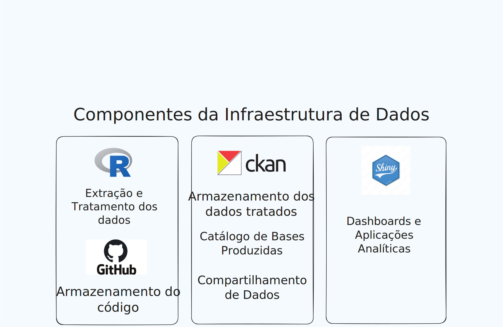

## Diagrama da Proposta de Infraestrutura de Dados do INCT

{width=90%}

## Componentes da Infraestrutura

### O CKAN

O [CKAN](https://ckan.org/) é uma solução mundialmente consolidada para gestão de dados abertos, utilizada por mais de 40 governos nacionais e centenas de organizações internacionais. É a tecnologia por trás da plataforma oficial do [Portal Brasileiro de Dados Abertos](https://dados.gov.br/home), de plataformas estaduais (ex. [Portal Alagoas em Dados](https://dados.al.gov.br/)) e também de plataformas de Programas de Pós Graduação de Universidades, como o [Portal de Dados Urbanos](https://portaldados.ppgau.uff.br/) Programa de Pós Graduação em Arquitetura e Urbanismo da Universidade Federal Fluminense (UFF).

A ferramenta foi concebida para ser um portal de dados. A arquitetura é construída em torno da ideia de catalogar, gerenciar, publicar e tornar encontráveis grandes quantidades de conjuntos de dados (datasets). Isto significa que o CKAN possui uma série de funcionalidades nativas para um sistema de gerenciamento de dados, como a criação de metadados padronizados (informações descritivas sobre os dados), um motor de busca poderoso (para encontrar os dados), controle de acesso (para a governança) e versionamento de dados. Pense no CKAN como uma biblioteca digital para dados; ele não apenas armazena os "livros" (os dados), mas também organiza as fichas catalográficas (metadados), facilitando que qualquer pessoa encontre o que precisa e consiga reutilizar os dados tendo transparência na metodologia e no processo utilizados para gerar os dados.

### R

O **[R](https://www.r-project.org/)** é a linguagem de programação escolhida para realizar os procedimentos de coleta, tratamento e análise de dados. 

### Github

O **[GitHub](https://github.com/)** é uma plataforma d como um repositório do código  R que será elaborado nas atividades de tratamento de dados e de elaboração de análises. O principal benefício é ter o registro centralizado de toda produção de código que, ao longo do ciclo do projeto, gerará os dados tratados e análises dos diferentes eixos e linhas.

### Shiny

O **[Shiny](https://shiny.posit.co/)** é tecnologia que será utilizado para construção de aplicações web interativas para comunicar resultados dos projetos com dados tratados.

